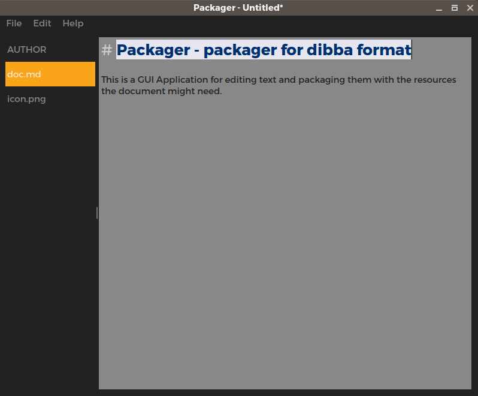

# Packager - packager for dibba format

This is a GUI Application for editing text and packaging them with the resources the document might need.


## Build
*Requires libmagic and it's headrs to be installed*

```
cd <project-directory>
qmake .
make -j 6
./packager
```
